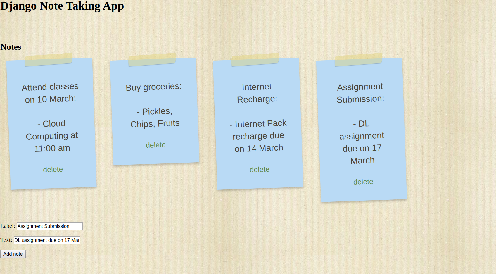

# Django Note Taking App

## Features:

* Add notes with title and content.
* Display notes. View all your notes at a single place.
* Delete notes which are not required.

## Dependencies

* Python 3
* Django >=3.x

## Deployment Instructions (For Ubuntu/Debian):

### Step 1 — Install Python and pip

To install Python we must first update the local APT repository. In your terminal window, we’ll input the command that follows. Note that the -y flag answers “yes” to prompts during the upgrade process. Remove the flag if you’d like the upgrade to stop for each prompt.

`sudo apt-get update && sudo apt-get -y upgrade`

It is recommended by the Django Software Foundation to use Python 3, so once everything is updated, we can install Python 3 by using the following command:

`sudo apt-get install python3`

To verify the successful installation of Python 3, run a version check with the python3 command:

`python3 -V`

This should display the current Python version being used. (Should be 3.x)

Now install `pip` in order to install Python packages.

`sudo apt-get install -y python3-pip`

To verify that pip was successfully installed, run the following command:

`pip3 -V`

### Step 2 — Install virtualenv

Using virtualenv, you can install software and Python packages in a contained development space, which isolates the installed software and packages from the rest of your machine’s global environment. It prevents conflicting packages or software from interacting with each other.

To install virtualenv, we will use the pip3 command, as shown below:

`pip3 install virtualenv`

Once it is installed, run a version check to verify that the installation has completed successfully:

virtualenv --version
We should see the following output, or something similar:

```
Output
15.1.0
```

You have successfully installed virtualenv.


### Step 3 — Install Django


We will install Django within a virtualenv.
This is ideal for when we need the version of Django to be isolated from the global environment of your server.

While in the server’s home directory, we have to create the directory that will contain our Django application. Run the following command to create a directory called django-apps, or another name of your choice. Then navigate to the directory.

```
mkdir django-apps
cd django-apps
``` 
While inside the django-apps directory, create your virtual environment. Let’s call it env.

`virtualenv env`

Now, activate the virtual environment with the following command:

`source env/bin/activate`

You’ll know it’s activated once the prefix is changed to (env), which will look similar to the following depending on what directory you are in:

`(env) ajit@ubuntu:$`

Once installed, verify your Django installation by running a version check:

`django-admin --version`

This, or something similar, will be the resulting output:

```
Output
2.0.1
```

### Step 4 — Installing the project

* Clone the project repository using:

`git clone https://github.com/ajitJJadhav/note-app.git`

* Change the working directory:

`cd note-app`

* Install the project:

```
python manage.py makemigrations
python manage.py migrate
```

* Run the project

`python manage.py runserver`

The app will be accessible using the address `http://127.0.0.1:8000/` which can be accessed using any browser.

## Sample



